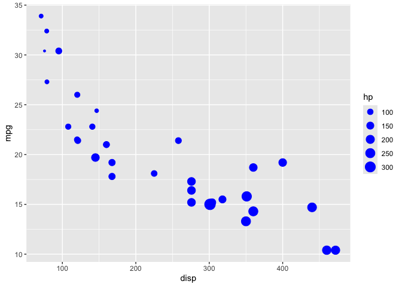
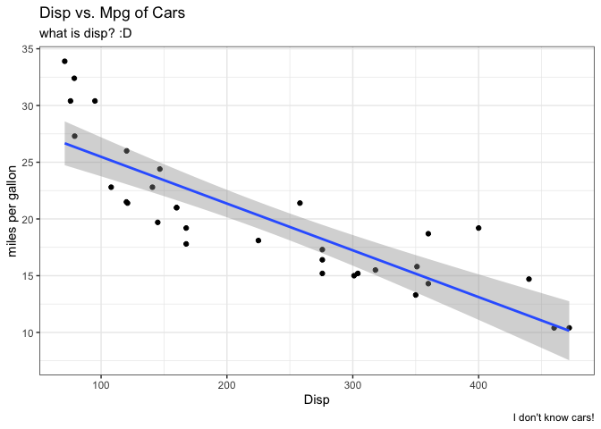
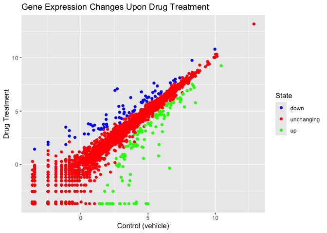
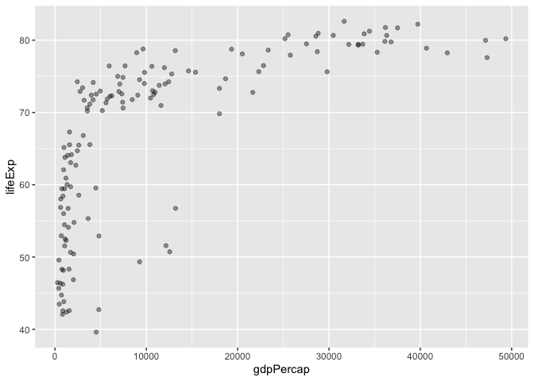
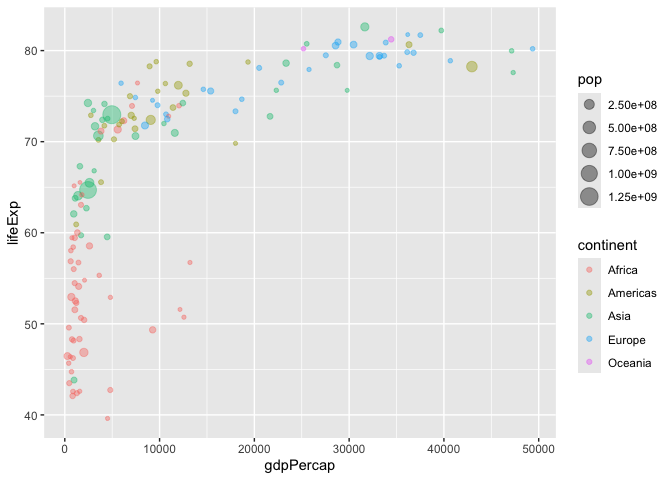
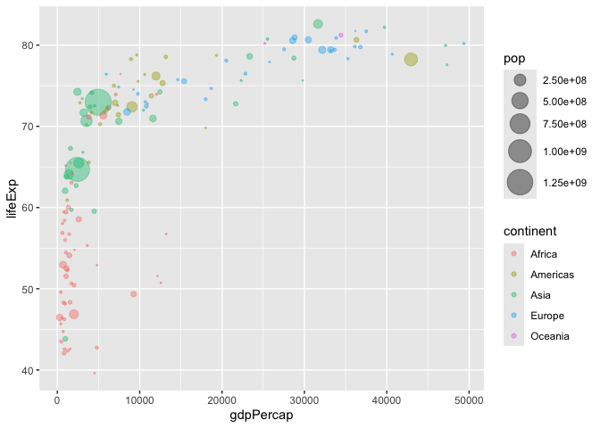
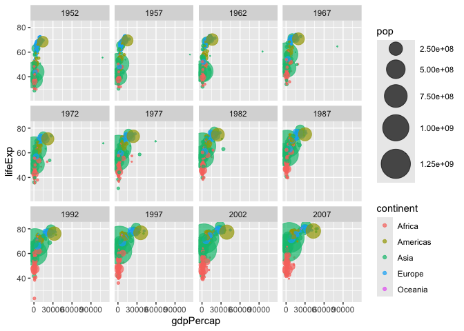
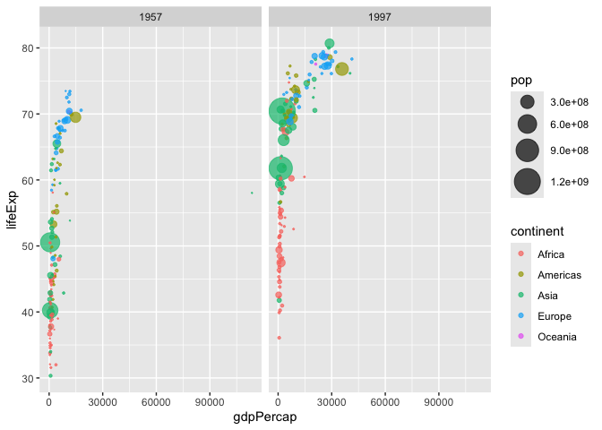
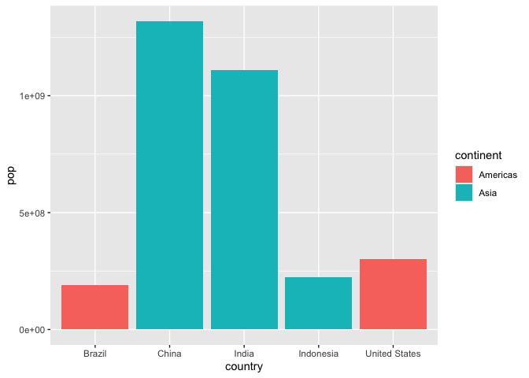

# Class 5: Data Viz with ggplot
Tiffany Chin (PID: 15700705)

R has many ways to make figures, graphs in particular. One that comes
with the **“base” R** package is the `plot()` function.

``` r
plot(cars)
```


A very popular package in this area is called **ggplot2**. Before using
the ggplot2 add-on package, I must install it with the
`install.packages("ggplot2")` command/function.

To load the package, use \`library(ggplot2)

``` r
library(ggplot2)
ggplot(cars, aes(speed, dist)) + 
  geom_point()
```


``` r
#can also do it the way below, exactly the same
ggplot(cars) +
  aes(x = speed, y = dist) +
  geom_point()
```


For “simple” plots like this one, base R code `plot()` will be much
shorter than ggplot code.

Let’s fit a model and show it on my plot.

``` r
library(ggplot2)
ggplot(cars, aes(speed, dist)) + 
  geom_point() +
  geom_smooth()
```

    `geom_smooth()` using method = 'loess' and formula = 'y ~ x'


Every ggplot has at least 3 layers.

- **data** (the numbers or information you want to plot, always has to
  be a data.frame for ggplot)
- **aes**thetics (mapping of your data columns to your plot: position,
  size, linetype, color, line width, shape, and more!)
- **geom**s (there are tons of geometries, basic ones are:
  `geom_point()`, `geom_line()`, `geom_col()`)

``` r
head(mtcars)
```

                       mpg cyl disp  hp drat    wt  qsec vs am gear carb
    Mazda RX4         21.0   6  160 110 3.90 2.620 16.46  0  1    4    4
    Mazda RX4 Wag     21.0   6  160 110 3.90 2.875 17.02  0  1    4    4
    Datsun 710        22.8   4  108  93 3.85 2.320 18.61  1  1    4    1
    Hornet 4 Drive    21.4   6  258 110 3.08 3.215 19.44  1  0    3    1
    Hornet Sportabout 18.7   8  360 175 3.15 3.440 17.02  0  0    3    2
    Valiant           18.1   6  225 105 2.76 3.460 20.22  1  0    3    1

Make a ggplot of the `mtcars` data set using `mpg` vs `disp` as a
scatter plot. Set the size of the points to `hp` and color all points to
blue.

``` r
ggplot(mtcars) +
  aes(disp, mpg, size = hp) +
  geom_point(col = "blue") 
```



Now, I will add labels to my plot, add a trend line, and change the plot
to a black and white theme.

``` r
ggplot(mtcars) +
  aes(disp, mpg) +
  geom_point() +
  labs(title = "Disp vs. Mpg of Cars",
       x = "Disp",
       y = "miles per gallon",
       subtitle = "what is disp? :D",
       caption = "I don't know cars!") +
  geom_smooth(method="lm") +
  theme_bw()
```

    `geom_smooth()` using formula = 'y ~ x'



``` r
#this creates a linear trend line while keeping standard error. can do se=FALSE to remove greyed out SE region.
```

Let’s try with a new dataset with both numeric and characters

``` r
url <- "https://bioboot.github.io/bimm143_S20/class-material/up_down_expression.txt"
genes <- read.delim(url)
head(genes)
```

            Gene Condition1 Condition2      State
    1      A4GNT -3.6808610 -3.4401355 unchanging
    2       AAAS  4.5479580  4.3864126 unchanging
    3      AASDH  3.7190695  3.4787276 unchanging
    4       AATF  5.0784720  5.0151916 unchanging
    5       AATK  0.4711421  0.5598642 unchanging
    6 AB015752.4 -3.6808610 -3.5921390 unchanging

Let’s add our own color codes and labels!

``` r
ggplot(genes) +
  aes(Condition2, Condition1, col=State) +
  geom_point() +
  scale_colour_manual(values=c("blue", "red", "green")) +
  labs(title = "Gene Expression Changes Upon Drug Treatment",
       x = "Control (vehicle)",
       y = "Drug Treatment")
```



Look at `ncol()`, `nrow()` and `table()`

``` r
ncol(genes)
```

    [1] 4

``` r
nrow(genes)
```

    [1] 5196

``` r
table(genes$State)
```


          down unchanging         up 
            72       4997        127 

there are 5196 altered with drug treatment compared to control.

Download new dataset to try out other extensions for other aesthetics

``` r
url <- "https://raw.githubusercontent.com/jennybc/gapminder/master/inst/extdata/gapminder.tsv"

gapminder <- read.delim(url)
```

Install and load dplyr library. Next, filter gapminder data.frame to
contain only the year 2007.

``` r
library(dplyr)
```


    Attaching package: 'dplyr'

    The following objects are masked from 'package:stats':

        filter, lag

    The following objects are masked from 'package:base':

        intersect, setdiff, setequal, union

``` r
gapminder_2007 <- gapminder %>% filter(year==2007)
```

Look at basic structure of `gapminder_2007`

``` r
head(gapminder_2007)
```

          country continent year lifeExp      pop  gdpPercap
    1 Afghanistan      Asia 2007  43.828 31889923   974.5803
    2     Albania    Europe 2007  76.423  3600523  5937.0295
    3     Algeria    Africa 2007  72.301 33333216  6223.3675
    4      Angola    Africa 2007  42.731 12420476  4797.2313
    5   Argentina  Americas 2007  75.320 40301927 12779.3796
    6   Australia   Oceania 2007  81.235 20434176 34435.3674

``` r
nrow(gapminder_2007)
```

    [1] 142

``` r
ncol(gapminder_2007)
```

    [1] 6

``` r
table(gapminder_2007$continent)
```


      Africa Americas     Asia   Europe  Oceania 
          52       25       33       30        2 

Make a basic scatter plot of lifeExp vs. gdpPercap. Make the points
slightly transparent using `alpha` set to `0.4`, which helps us see
individual points more clearly.

``` r
ggplot(gapminder_2007) +
  aes(gdpPercap, lifeExp) +
  geom_point(alpha = 0.4)
```



We can add further variables to `aes()` to include additional
information from the dataset besides life expectancy and GDP per capita.
Keep in mind that ggplot coloring scheme is based on the categorical
type of the variable used. For example, continent is character data, so
it shows individual color points. If we were to use population for
color, it would convert to numeric and result in a continuous color
legend.

``` r
ggplot(gapminder_2007) +
  aes(gdpPercap, lifeExp, col = continent, size = pop) +
  geom_point(alpha = 0.4)
```



Point size can also be adjusted, since the above point sizes are not
proportional so it’s harder to see the population differences of each
country. Use `scale_size_area()` to alter the size to be more
proportional.

``` r
ggplot(gapminder_2007) +
  aes(gdpPercap, lifeExp, col = continent, size = pop) +
  geom_point(alpha = 0.4) +
  scale_size_area(max_size = 10)
```



We can also go back to the original `gapminder` data.frame so that we
can plot two years side-by-side using `facet_wrap(~year)`.

``` r
ggplot(gapminder) +
  aes(gdpPercap, lifeExp, col = continent, size = pop) +
  geom_point(alpha = 0.7) +
  scale_size_area(max_size = 15) +
  facet_wrap(~year)
```



This will give back all the plots for every year, so if you only want to
compare two years, you can `filter` the original gapminder dataset to
include the two you want before using `facet_wrap(~year)`

``` r
gapminder_few <- gapminder %>% filter(year == 1957 | year == 1997)
ggplot(gapminder_few) +
  aes(gdpPercap, lifeExp, col = continent, size = pop) +
  geom_point(alpha = 0.7) +
  scale_size_area(max_size = 10) +
  facet_wrap(~year)
```



Now make a bar chart of the top 5 countries with largest population
size.

``` r
gapminder_top5 <- gapminder %>%
  filter(year ==2007) %>%
  arrange(desc(pop)) %>%
  top_n(5, pop)
gapminder_top5
```

            country continent year lifeExp        pop gdpPercap
    1         China      Asia 2007  72.961 1318683096  4959.115
    2         India      Asia 2007  64.698 1110396331  2452.210
    3 United States  Americas 2007  78.242  301139947 42951.653
    4     Indonesia      Asia 2007  70.650  223547000  3540.652
    5        Brazil  Americas 2007  72.390  190010647  9065.801

``` r
ggplot(gapminder_top5) +
  aes(country, pop, fill = continent) +
  geom_col()
```



Last note, to save a figure that is more high resolution for
publications you can use `ggsave()` function and specify directory to
save in, pixel height and width, and resolution. Without specifying,
will be default parameters and will save to current working directory.

``` r
ggsave("myplot.png")
```

    Saving 7 x 5 in image

Another fun add-on is patchwork that can combine plots!
