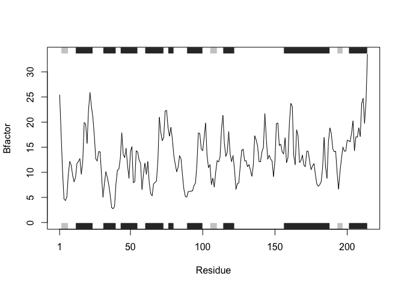
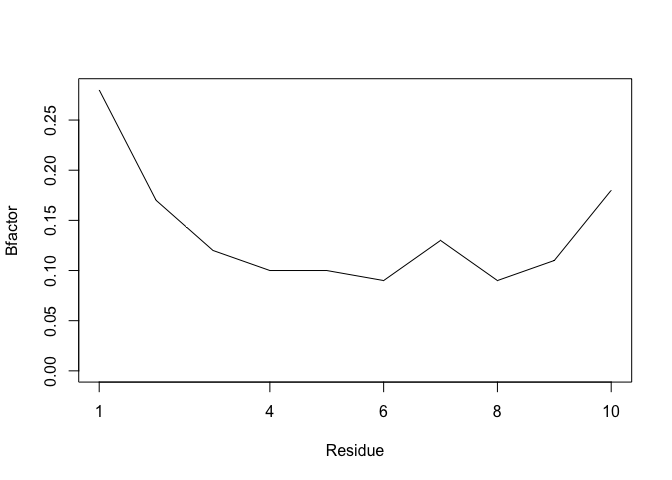

# Class 6: R Functions HW
Tiffany 15700705

``` r
# Can you improve this analysis code?
library(bio3d) #first load library that has pdbs too
s1 <- read.pdb("4AKE") # kinase with drug
```

      Note: Accessing on-line PDB file

``` r
s2 <- read.pdb("1AKE") # kinase no drug
```

      Note: Accessing on-line PDB file
       PDB has ALT records, taking A only, rm.alt=TRUE

``` r
s3 <- read.pdb("1E4Y") # kinase with drug
```

      Note: Accessing on-line PDB file

``` r
s1.chainA <- trim.pdb(s1, chain="A", elety="CA")
s2.chainA <- trim.pdb(s2, chain="A", elety="CA")
s3.chainA <- trim.pdb(s3, chain="A", elety="CA")
s1.b <- s1.chainA$atom$b
s2.b <- s2.chainA$atom$b
s3.b <- s3.chainA$atom$b
plotb3(s1.b, sse=s1.chainA, typ="l", ylab="Bfactor")
```


``` r
plotb3(s2.b, sse=s2.chainA, typ="l", ylab="Bfactor")
```


``` r
plotb3(s3.b, sse=s3.chainA, typ="l", ylab="Bfactor")
```


How do you write a function to do the same as the above? First, find the
inputs for the function by looking at a single iteration to make sure
that the code we plan to wrap in `function()` works for an example
input! We want:

-Reading the desired pdb file using `read.pdb()` -Trim using
`trim.pdb()` to only contain the information you want: “A” chain and
“CA” elety -Now use `$` to filter to only look at the data we want, like
the atom `data.frame` and b chain information. -Now, plot using
`plotb3()` so that we are making a line plot and plotting the amino acid
residues against the b information.

``` r
x <- "4AKE" #assign pdb
s <- read.pdb(x) #read pdb and set as "s"
```

      Note: Accessing on-line PDB file

``` r
s.chainA <- trim.pdb(s, chain = "A", elety = "CA") #trim s list and set as s.chainA
s.b <- s.chainA$atom$b #only keep desired info from list
plotb3(s.b, sse = s.chainA, typ = "l", ylab= "Bfactor") #plot!
```


The below function utilizes the original code, but can be modified by
specifying your desired pdb set as x. In this case, `sapply()` is used
to specify multiple inputs to run the function on, since the function
isn’t suited normally to be applied to multiple inputs. `sapply()` will
allow us to create a vector to have the function run on many pdbs.

``` r
funky <- function(x) {
  s <- read.pdb(x)
  s.chainA <- trim.pdb(s, chain = "A", elety = "CA")
  s.b <- s.chainA$atom$b
  plotb3(s.b, sse = s.chainA, typ = "l", ylab= "Bfactor")
}
#works on all 3!
sapply(c("4AKE", "1AKE", "1E4Y"), funky)
```

      Note: Accessing on-line PDB file


      Note: Accessing on-line PDB file

       PDB has ALT records, taking A only, rm.alt=TRUE


      Note: Accessing on-line PDB file



    $`4AKE`
    NULL

    $`1AKE`
    NULL

    $`1E4Y`
    NULL

``` r
#works with one too!
funky("1n9u")
```

      Note: Accessing on-line PDB file


