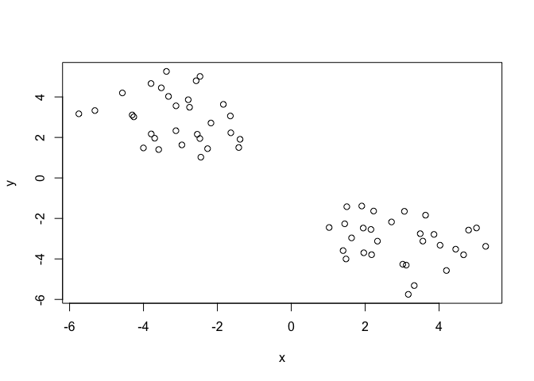
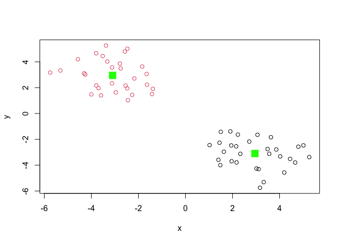

# Class 7: Machine Learning 1
Tiffany Chin PID 15700705

Before we get into clustering methods, let’s make some sample data to
cluster where we know what the answer should be.

To help with this, I will use the `rnorm()` function.

``` r
hist(rnorm(150000, mean = c(-3,3)))
```


``` r
#rnorm(150000, mean = c(-3,3))
#same as
n = 150000
hist(c(rnorm(n, mean =3), rnorm(n, mean = -3)))
```


``` r
n=30
x <- c(rnorm(n, mean =3), rnorm(n, mean = -3))
#set y as reverse of x
y <- rev(x)
#use cbind to combine x and y together
z <- cbind(x,y)
z
```

                  x         y
     [1,]  1.946610 -2.474502
     [2,]  3.016683 -4.262153
     [3,]  4.198342 -4.571594
     [4,]  4.797838 -2.575350
     [5,]  1.502329 -1.421722
     [6,]  4.449146 -3.518373
     [7,]  3.560297 -3.119943
     [8,]  1.907423 -1.386840
     [9,]  2.228021 -1.636268
    [10,]  2.172955 -3.790539
    [11,]  3.489487 -2.753449
    [12,]  1.401392 -3.588754
    [13,]  5.260692 -3.378488
    [14,]  2.331662 -3.122542
    [15,]  1.480651 -4.001983
    [16,]  1.445464 -2.265548
    [17,]  3.060886 -1.648901
    [18,]  1.631415 -2.960976
    [19,]  1.024113 -2.448009
    [20,]  3.166448 -5.749965
    [21,]  5.011982 -2.470632
    [22,]  4.026005 -3.322817
    [23,]  2.156086 -2.543995
    [24,]  2.712033 -2.173912
    [25,]  3.633326 -1.838754
    [26,]  1.961709 -3.697046
    [27,]  3.326890 -5.315366
    [28,]  4.662896 -3.796100
    [29,]  3.861487 -2.788946
    [30,]  3.110202 -4.305662
    [31,] -4.305662  3.110202
    [32,] -2.788946  3.861487
    [33,] -3.796100  4.662896
    [34,] -5.315366  3.326890
    [35,] -3.697046  1.961709
    [36,] -1.838754  3.633326
    [37,] -2.173912  2.712033
    [38,] -2.543995  2.156086
    [39,] -3.322817  4.026005
    [40,] -2.470632  5.011982
    [41,] -5.749965  3.166448
    [42,] -2.448009  1.024113
    [43,] -2.960976  1.631415
    [44,] -1.648901  3.060886
    [45,] -2.265548  1.445464
    [46,] -4.001983  1.480651
    [47,] -3.122542  2.331662
    [48,] -3.378488  5.260692
    [49,] -3.588754  1.401392
    [50,] -2.753449  3.489487
    [51,] -3.790539  2.172955
    [52,] -1.636268  2.228021
    [53,] -1.386840  1.907423
    [54,] -3.119943  3.560297
    [55,] -3.518373  4.449146
    [56,] -1.421722  1.502329
    [57,] -2.575350  4.797838
    [58,] -4.571594  4.198342
    [59,] -4.262153  3.016683
    [60,] -2.474502  1.946610

``` r
plot(z)
```



## K-means clustering

The function in base R for k-means clustering is called `kmeans()`. The
two arguments it needs, without defaults, is x (our data) and centers
(the number of clusters, *k*).

``` r
km <- kmeans(z, 2)
km
```

    K-means clustering with 2 clusters of sizes 30, 30

    Cluster means:
              x         y
    1  2.951149 -3.097638
    2 -3.097638  2.951149

    Clustering vector:
     [1] 1 1 1 1 1 1 1 1 1 1 1 1 1 1 1 1 1 1 1 1 1 1 1 1 1 1 1 1 1 1 2 2 2 2 2 2 2 2
    [39] 2 2 2 2 2 2 2 2 2 2 2 2 2 2 2 2 2 2 2 2 2 2

    Within cluster sum of squares by cluster:
    [1] 77.47546 77.47546
     (between_SS / total_SS =  87.6 %)

    Available components:

    [1] "cluster"      "centers"      "totss"        "withinss"     "tot.withinss"
    [6] "betweenss"    "size"         "iter"         "ifault"      

\#clustering vector shows which cluster that value has been assigned to.
There are 30 points assigned to 1 cluster, and 30 assigned to the 2nd.
Since our x and y are just reverse of each other, the first 30 are
assigned to 1 and then last 30 are assigned to 2nd, which makes sense
based off distance.

``` r
#to print out the centers of the two clusters
km$centers
```

              x         y
    1  2.951149 -3.097638
    2 -3.097638  2.951149

Q. Print out the cluster membership vector (i.e. our main answer). Which
cluster is everything in?

``` r
km$cluster
```

     [1] 1 1 1 1 1 1 1 1 1 1 1 1 1 1 1 1 1 1 1 1 1 1 1 1 1 1 1 1 1 1 2 2 2 2 2 2 2 2
    [39] 2 2 2 2 2 2 2 2 2 2 2 2 2 2 2 2 2 2 2 2 2 2

Make a plot of this data with the clustering data shown, using base R
plot

``` r
plot(z, col="red")
```


``` r
#the above colors all points red, but we want this separated
#below, use the km clustering results to color the plot
plot(z, col = km$cluster)
#to this plot, add center points as green boxes
points(km$centers, col = "green", pch = 15, cex =2)
```



Q. Can you cluster our data in `z` into four clusters?

``` r
km4 <- kmeans(z, 4)
km4
```

    K-means clustering with 4 clusters of sizes 16, 16, 14, 14

    Cluster means:
              x         y
    1 -2.562518  2.037255
    2  2.037255 -2.562518
    3  3.995600 -3.709203
    4 -3.709203  3.995600

    Clustering vector:
     [1] 2 3 3 3 2 3 3 2 2 2 3 2 3 2 2 2 2 2 2 3 3 3 2 2 2 2 3 3 3 3 4 4 4 4 1 1 1 1
    [39] 4 4 4 1 1 1 1 1 1 4 1 4 1 1 1 4 4 1 4 4 4 1

    Within cluster sum of squares by cluster:
    [1] 18.33194 18.33194 20.69018 20.69018
     (between_SS / total_SS =  93.8 %)

    Available components:

    [1] "cluster"      "centers"      "totss"        "withinss"     "tot.withinss"
    [6] "betweenss"    "size"         "iter"         "ifault"      

``` r
plot(z, col = km4$cluster)
points(km4$centers, col = "green", pch = 15, cex = 2)
```


``` r
#kmeans will always map clusters based on how many k you specify, which is an issue when using it on unknown data to specify things like cell types. You can easily over- or under-cluster.
#also re plotting this will be different each time because clustering will be different!!
```

## Hierarchical Clustering

The main function for hierarchical clustering in base R is called
`hclust()`. We will cluster step-by-step in a hierarchical cluster,
starting from 60 (how many points of data we have) and merging clusters
of similarity. More work than k-means clustering but more reliable
clustering method than randomly assigning k. Unlike `kmeans()`, I cannot
just pass in my data as an input. I first need a **distance matrix**
from my data that will measure distance between every point and all
other 59 points.

``` r
d <- dist(z)
hc <- hclust(d)
hc
```


    Call:
    hclust(d = d)

    Cluster method   : complete 
    Distance         : euclidean 
    Number of objects: 60 

There is a specific hclust plot() method we can use

``` r
plot(hc)
abline(h=10, col="red")
```


To get my main clustering result (i.e. the membership vector), I can
“cut” my tree at a given height. To do this I will use the `cutree()` at
the line that we looked at in the above plot.

``` r
grps <- cutree(hc, h=10)
grps
```

     [1] 1 1 1 1 1 1 1 1 1 1 1 1 1 1 1 1 1 1 1 1 1 1 1 1 1 1 1 1 1 1 2 2 2 2 2 2 2 2
    [39] 2 2 2 2 2 2 2 2 2 2 2 2 2 2 2 2 2 2 2 2 2 2

``` r
plot(z, col = grps)
```


## Principal Component Analysis

PCA projects features onto the principal components. The motivation is
to reduce the features dimensionality while only losing a small amount
of information.

Principal component analysis (PCA) is a well established “multivariate
statistical technique” used to reduce the dimensionality of a complex
data set to a more manageable number (typically 2D or 3D). This method
is particularly useful for highlighting strong paterns and relationships
in large datasets (i.e. revealing major similarities and diferences)
that are otherwise hard to visualize. As we will see again and again in
this course PCA is often used to make all sorts of bioinformatics data
easy to explore and visualize.

## Lab 7 Worksheet: PCA of UK food data

Import UK_foods.csv

``` r
url <- "https://tinyurl.com/UK-foods"
x <- read.csv(url)
```

Q1. How many rows and columns are in your new data frame named x? What R
functions could you use to answer this question?

``` r
dim(x)
```

    [1] 17  5

``` r
#View(x)
head(x)
```

                   X England Wales Scotland N.Ireland
    1         Cheese     105   103      103        66
    2  Carcass_meat      245   227      242       267
    3    Other_meat      685   803      750       586
    4           Fish     147   160      122        93
    5 Fats_and_oils      193   235      184       209
    6         Sugars     156   175      147       139

Row-names were not set up properly since we only want 4 columns, one for
each country. This is a common occurrence where the first column in the
x dataframe contains rownames considered as a new column. Fix this
below.

``` r
rownames(x) <- x[,1]
x <- x[, -1]
head(x)
```

                   England Wales Scotland N.Ireland
    Cheese             105   103      103        66
    Carcass_meat       245   227      242       267
    Other_meat         685   803      750       586
    Fish               147   160      122        93
    Fats_and_oils      193   235      184       209
    Sugars             156   175      147       139

``` r
dim(x)
```

    [1] 17  4

Another way to setting correct row-names could be to re-read the data
file again and specify a row.names argument of read.csv() to say that
the first column contains row.names

``` r
x <- read.csv(url, row.names =1)
head(x)
```

                   England Wales Scotland N.Ireland
    Cheese             105   103      103        66
    Carcass_meat       245   227      242       267
    Other_meat         685   803      750       586
    Fish               147   160      122        93
    Fats_and_oils      193   235      184       209
    Sugars             156   175      147       139

``` r
dim(x)
```

    [1] 17  4

Q2. Which approach to solving the ‘row-names problem’ mentioned above do
you prefer and why? Is one approach more robust than another under
certain circumstances?

*I prefer using the 2nd method of specifying row.names=1 when performing
read.csv() because of how you can accidentally remove columns using the
first method if you aren’t careful.*

``` r
barplot(as.matrix(x), beside=T, col=rainbow(nrow(x)))
```


Generating a pair-wise plot can help somewhat to understanding the
differences and similarities in this dataset.

``` r
pairs(x, col=rainbow(10), pch=16)
```


We can see with the pairwise plot that N.Ireland differs from England,
Wales, and Scotland in that there are a few points, namely the blue and
teal, that don’t line up with the other countries. Looking at pairwise
plots, those that follow the diagonal in the plot means that the x and y
(the two countries of comparison) have a similar correlation for that
data. To transpose means to sway the x and y data, so swapping the
column and rows.

**PCA**

We will perform PCA in R using the base R `prcomp()` function. This
function expects observations to be rows and variables to be columns, so
we need to transpose our data.frame matrix with the `t()` transpose
function.

``` r
pca <- prcomp(t(x)) 
summary(pca)
```

    Importance of components:
                                PC1      PC2      PC3       PC4
    Standard deviation     324.1502 212.7478 73.87622 2.921e-14
    Proportion of Variance   0.6744   0.2905  0.03503 0.000e+00
    Cumulative Proportion    0.6744   0.9650  1.00000 1.000e+00

Plot PC1 and PC2 against each other.

``` r
#"x" in pca data.frame contains the countries and PC info.
plot(pca$x[,1], pca$x[,2], xlab= "PC1", ylab= "PC2", xlim= c(-270,500))
text(pca$x[,1], pca$x[,2], colnames(x))
```


Customize this plot so the colors of the country names match the colors
in our UK and Ireland map and table at the start of the document.

``` r
plot(pca$x[,1], pca$x[,2], xlab= "PC1 (67.4%)", ylab= "PC2 (29%)", xlim= c(-270,500))
text(pca$x[,1], pca$x[,2], colnames(x), col = c("black", "red", "blue", "green"))
abline(h=0, col="gray", lty="dashed")
abline(v=0, col="gray", lty="dashed")
```


# Variable Loadings plot

We can also consider the influence of each of the original variables
upon the principal components (typically known as loading scores). This
information can be obtained from the prcomp() returned \$rotation
component. It can also be summarized with a call to biplot(), see below:

``` r
## Lets focus on PC1 as it accounts for > 90% of variance 
par(mar=c(10, 3, 0.35, 0))
barplot( pca$rotation[,1], las=2 )
```


``` r
pca$rotation
```

                                 PC1          PC2         PC3          PC4
    Cheese              -0.056955380  0.016012850  0.02394295 -0.409382587
    Carcass_meat         0.047927628  0.013915823  0.06367111  0.729481922
    Other_meat          -0.258916658 -0.015331138 -0.55384854  0.331001134
    Fish                -0.084414983 -0.050754947  0.03906481  0.022375878
    Fats_and_oils       -0.005193623 -0.095388656 -0.12522257  0.034512161
    Sugars              -0.037620983 -0.043021699 -0.03605745  0.024943337
    Fresh_potatoes       0.401402060 -0.715017078 -0.20668248  0.021396007
    Fresh_Veg           -0.151849942 -0.144900268  0.21382237  0.001606882
    Other_Veg           -0.243593729 -0.225450923 -0.05332841  0.031153231
    Processed_potatoes  -0.026886233  0.042850761 -0.07364902 -0.017379680
    Processed_Veg       -0.036488269 -0.045451802  0.05289191  0.021250980
    Fresh_fruit         -0.632640898 -0.177740743  0.40012865  0.227657348
    Cereals             -0.047702858 -0.212599678 -0.35884921  0.100043319
    Beverages           -0.026187756 -0.030560542 -0.04135860 -0.018382072
    Soft_drinks          0.232244140  0.555124311 -0.16942648  0.222319484
    Alcoholic_drinks    -0.463968168  0.113536523 -0.49858320 -0.273126013
    Confectionery       -0.029650201  0.005949921 -0.05232164  0.001890737
